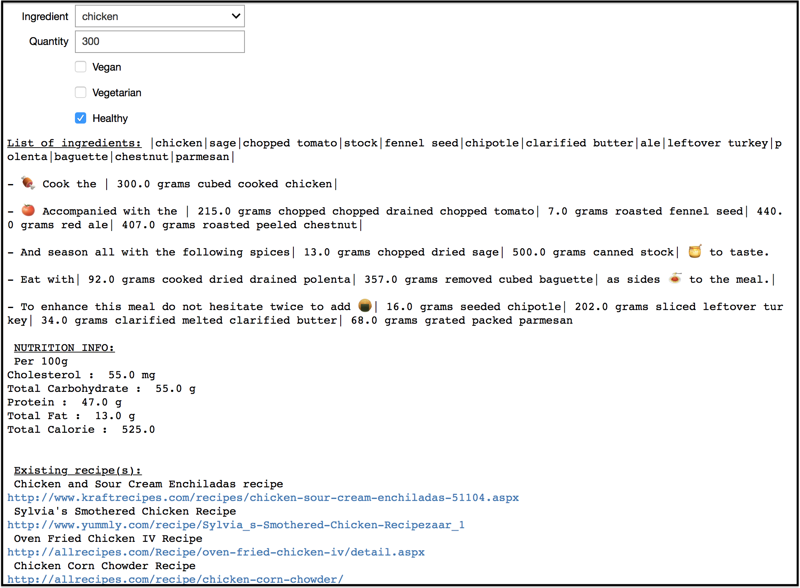

# Title : Food symphony

# Abstract

Have you ever wondered while cooking whether these ingredients could be great together ? A good example is certainly the Hawaiian pizza, which mixes, original pizza ingredients like tomato, ham and mozzarella, with pineapple, an exotic ingredient.

Thus, using the big dataset gathering cooking recipes all around the world, our project's goal is to extract the combination of ingredients and try to find an interconnection between them.
First of all, will be to extract the essence of each ingredient in a recipe and then analyze what the ingredient bring in the recipe (sweet, spicy, ...). The second step, will be to find correlation between recipes in order to map which combinations of different ingredients blend the best together to give tasteful meals. Finally, we imagine an interface where users will give as input a series of ingredients and constraints, i.e. (vegan, with meat, with fish, etc.) and a recipe will be suggested to them. From there we can use machine learning to create new recipes from what we have learned. Theoretically, this mechanism will consider all ingredients seen in the learning phase, thus new unknown mixtures of ingredients can emerge giving rise to the best combination ever (hopefully).

Story:

We believe that ingredients in a recipe are like harmonies in music, separated they are pleasant to hear, but when perfectly combined harmonies can come up with something special (Schubert' Symphonies).
Therefore, we are convinced that some of the best combinations are still waiting to be found. Indeed, best chef in the world always tries when making a creation, to have all ingredients in osmosis. What if the best combination is a fish from Tahiti, a spice from Tierra del Fuego, some exotic vegetable from Vietnam and olive oil from Italy. How would be able to produce it?

Motivation: We are three students that enjoy cooking and eating, however, as students, it's not always easy to take the time to check for a recipe, look at the ingredients we already have and what we are missing. Also, it's not easy to have new ideas or to know whether what are left in our fridges could be cooked together.  Thus, we believe this project suit us well. We have the opportunity to work on a subject that we enjoy and to create something new that may help other people to improve all the cooking process.

# Research questions

1. What is the essence of each ingredient and what do they bring in a recipe ?

2. What kind of correlation between ingredient will be the best to find the harmony in a recipe ?

3. What should we implement in our interface to make it interactive and friendly using ?

# Dataset

To achieve our goals, we will use Cooking recipes dataset, where we can get the list of ingredients turn into ingredients bag of words in order to group them into categories and characterize their essence and their role in the recipe. Therefore, we will be able to determine the correlation by the number of occurrences and their role.

Besides ,the characteristics of each ingredients such as the total amount of calories and the calories by group, i.e. fat, protein, sugar, as well as the sodium and cholesterol content will be extracted to enrich our work.

# Results
For each recipe, ingredients, quantities and techniques were extracted from the dataset. From that, the user can select one ingredient with its quantity and eventually a nutrition constraint and our algorithm makes a special recipe and also show existing recipes. The creation of recipes was done by using the co occurrence matrix of ingredients and  by applying the k-NN regression on it, to find proximity within the ingredients. The quantities of each ingredient in the new recipe were calculated using the ratio of the mean of each ingredient according to 1 serving.

Our objective was achieved, however, we believe we will not be able to create the best food symphony as the majority of the recipes are European, and from USA. To create the best food symphony one need recipes from all around the word to find unsuspected association of ingredients.

# Member Contributions

Etienne Dubois : Quantity serving webscrapping, preprocess functions, quantities & techniques for special recipes
Tom Suter : Filters designer, Unit value webscrapping, Outliers, Linear Regression for nutrient informations
Jonathan Chansin : Ingredient list webscrapping, Special recipes code, data analysis plots.
